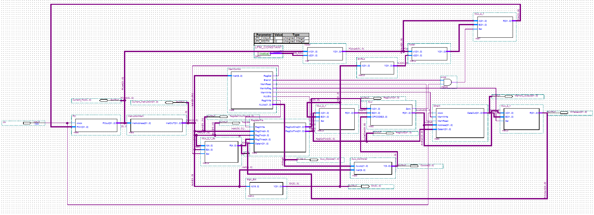

# Single-Cycle MIPS Processor

<p align="center">
    
</p>

## Overview

This repository contains the complete VHDL implementation, simulation files, and documentation for a **Single-Cycle MIPS Processor** developed as the final project for EENG 5342 (Advanced Digital Design) at Georgia Southern University. The processor executes a subset of the MIPS instruction set, including R-type arithmetic operations and I-type memory access instructions, with all components designed from scratch in VHDL and integrated using Intel Quartus Prime.

**Project Documentation:**
- [📊 Project Presentation](Presentation/Main.pdf)
- [📄 Project Report](Writeup/Goyal%20Final%20Project%20Report.pdf)
- [🎥 Video Walkthrough](https://www.youtube.com/watch?v=19uMkeUoLpE)

## Project Description

The MIPS (Microprocessor without Interlocked Pipeline Stages) architecture represents one of the most influential reduced instruction set computing (RISC) designs in computer engineering. This project implements a single-cycle processor where each instruction executes in exactly one clock cycle, making it an ideal architecture for understanding fundamental processor operation.

### Supported Instructions

**R-Type Instructions:**
- `add` - Addition
- `sub` - Subtraction  
- `and` - Logical AND
- `or` - Logical OR
- `slt` - Set on less than

**I-Type Instructions:**
- `lw` - Load word from memory
- `sw` - Store word to memory

### Key Features

- **Complete Datapath Implementation**: All major processor components designed and integrated
- **32 General-Purpose Registers**: Full MIPS register file with dual read ports and single write port
- **Separate Instruction and Data Memory**: Harvard architecture with 128 bytes of data memory
- **Full Control Logic**: Main control unit and ALU controller for instruction decode
- **Functional Verification**: Validated through simulation with test instruction sequences
- **Modular Design**: Each component implemented as independent VHDL entity for maintainability

## Architecture

The processor follows the classic single-cycle MIPS datapath architecture, based on the design by Patterson and Hennessy. The implementation consists of the following major components:

### Core Components

1. **Program Counter (PC)**: Maintains the address of the current instruction being executed
2. **Instruction Memory**: ROM storing the program code, 4 words capacity
3. **Main Control Unit**: Decodes 6-bit opcode and generates control signals (RegDst, ALUSrc, MemtoReg, RegWrite, MemRead, MemWrite, Branch, ALUOp)
4. **Register File**: 32 registers (32-bit each) with dual read and single write ports
5. **ALU (Arithmetic Logic Unit)**: Performs arithmetic and logical operations with 16 supported operations
6. **ALU Controller**: Translates high-level ALUOp and function field into specific ALU control signals
7. **Data Memory**: 32-word RAM for load/store operations
8. **Sign Extension Unit**: Extends 16-bit immediate values to 32-bit signed values
9. **Multiplexers**: Various 32-bit and 5-bit 2-to-1 muxes for data routing
10. **Adders**: Dedicated adders for PC+4 and branch target calculation
11. **Shift Left 2**: Converts word offsets to byte offsets for branch addressing

### Datapath Operation

1. **Fetch**: PC provides instruction address to instruction memory
2. **Decode**: Control unit decodes opcode; register file reads source operands
3. **Execute**: ALU performs operation based on instruction type
4. **Memory**: Data memory accessed for load/store instructions
5. **Writeback**: Result written back to register file

All stages complete within a single clock cycle.

## Repository Structure

```
FINAL_PROJECT/
├── Quartus/                    # Intel Quartus Prime project files
│   ├── *.vhd                  # VHDL source files for all components
│   ├── *.bsf                  # Block symbol files
│   ├── Datapath.bdf           # Top-level block diagram schematic
│   ├── Waveform.vwf           # Vector waveform file for simulation
│   ├── output_files/          # Compilation and synthesis reports
│   └── simulation/            # Simulation results and scripts
├── Writeup/                   # Project documentation
│   ├── Goyal Final Project Report.pdf
│   ├── Main.qmd               # Quarto source for report
│   └── img/                   # Documentation images
├── Presentation/              # Project presentation materials
│   ├── Main.pdf               # Presentation slides
│   ├── Main.tex               # LaTeX source
│   └── figures/               # Presentation figures
└── README.md
```

## Installation and Setup

### Requirements

To replicate this project, you will need:

- **Intel Quartus Prime** (Lite Edition 23.1.1 or later)
- **Questa/ModelSim** (for functional simulation)
- **Target Platform**: Cyclone V FPGA (tested on DE10-Standard board)

### Getting Started

1. **Clone the repository:**

```bash
git clone https://github.com/yourusername/single-cycle-mips-processor.git
cd single-cycle-mips-processor
```

2. **Open the Quartus project:**

```bash
cd Quartus
# Open Datapath.qpf in Quartus Prime
```

3. **Compile the design:**
   - In Quartus: Processing → Start Compilation
   - Or use command line: `quartus_sh --flow compile Datapath`

4. **Run functional simulation:**
   - Tools → Run Simulation Tool → RTL Simulation
   - Load `Waveform.vwf` for pre-configured test vectors

## Usage

### Modifying the Program

The instruction memory is initialized in `InstructionMem.vhd`:

```vhdl
SIGNAL myarray : INST_FILE_TYPE := (
    x"012A4020",  -- add $8, $9, $10
    x"01285022",  -- sub $10, $9, $8  
    x"8E510000",  -- lw $17, 0($18)
    x"AE290004"   -- sw $9, 4($17)
);
```

To run a different program:
1. Encode your MIPS instructions as 32-bit hexadecimal values
2. Update the array in `InstructionMem.vhd`
3. Recompile the design in Quartus
4. Run simulation to verify execution

### Initial Conditions

- **Registers**: Initialized with index values ($0=0, $1=1, ..., $31=31)
- **Data Memory**: Initialized with sequential values (address 0 = 0, address 4 = 1, etc.)
- **Clock Period**: 1 µs (1 MHz) in simulation

### Viewing Results

After simulation:
1. Open the waveform viewer in Questa/ModelSim
2. Key signals to monitor:
   - `PC` - Program counter value
   - `InstOUT` - Current instruction
   - `RegOutOne`, `RegOutTwo` - Register file outputs
   - `ALU_Result` - ALU computation result
   - `DataOut` - Data memory output

## Component Descriptions

### Program Counter (PC)
32-bit register that holds the address of the current instruction. Updates synchronously on the rising clock edge.

### Main Control Unit
Combinational logic that examines the opcode (instruction bits 31-26) and generates eight control signals to orchestrate datapath operation.

### Register File
Implements 32 general-purpose 32-bit registers. Provides dual asynchronous read ports and one synchronous write port.

### ALU
Supports 16 operations including arithmetic (add, subtract, increment/decrement), logical (AND, OR, NOR, NAND, NOT), and comparison (set less than). Generates a Zero flag for branch decisions.

### ALU Controller
Two-level decoder that combines the 2-bit ALUOp from main control with the 6-bit function field to generate the 4-bit ALU operation code.

### Data Memory
32-word (128-byte) RAM with separate read and write ports. Operates on falling clock edge to ensure address stability.

## Simulation Results

The processor was validated using a test program with four instructions:

| Time | Instruction | Operation | Expected Result |
|------|-------------|-----------|-----------------|
| 0 µs | `0x012A4020` | `add $8, $9, $10` | $8 = 9 + 16 = 25 |
| 1 µs | `0x01285022` | `sub $10, $9, $8` | $10 = 9 - 25 = -16 |
| 2 µs | `0x8E510000` | `lw $17, 0($18)` | $17 = Mem[$18] |
| 3 µs | `0xAE290004` | `sw $9, 4($17)` | Mem[$17+4] = $9 |

Waveform analysis confirmed correct:
- Instruction fetch and decode
- Register file reads
- ALU operations and control signal generation
- Memory access timing
- Register writeback

See the [waveform documentation](Writeup/img/Waveform.png) for detailed signal traces.

## Known Issues and Limitations

### Current Limitations
- **Instruction Memory Size**: Only 4 instructions (expandable by modifying array size)
- **Data Memory Size**: 128 bytes (32 words)
- **No Branch Support**: Branch calculation hardware present but not fully implemented
- **No Jump Instructions**: j, jal, jr not supported
- **No Pipeline**: Single-cycle limits clock frequency to slowest instruction path
- **Register $0**: Not hardwired to zero (implementation detail)

### Development Challenges Overcome
- Bus naming convention inconsistencies between modules
- Quartus schematic editor reliability issues
- XOR/SUB opcode conflict in original ALU implementation
- Multiplexer type width mismatches (required separate 5-bit mux)
- Questa license configuration on personal development machine

## Future Enhancements

### Performance Improvements
- **5-Stage Pipeline**: Implement IF/ID/EX/MEM/WB pipeline with hazard detection
- **Data Forwarding**: Bypass paths to eliminate pipeline stalls
- **Branch Prediction**: Reduce control hazard penalties

### Feature Extensions
- **Jump Instructions**: Add j, jal, jr support for function calls
- **Extended ALU**: Implement multiplication, division, and shift operations
- **Larger Memory**: Expand instruction and data memory capacity
- **Exception Handling**: Add overflow detection and exception logic

### Development Tools
- **UART Interface**: Real-time output display of register/memory contents
- **Dynamic Program Loading**: Load instructions at runtime without recompilation
- **Hardware Debugger**: Breakpoints and single-step execution
- **FPGA Deployment**: Synthesize and deploy to DE10-Standard board

## Testing

The processor was tested through functional simulation in Questa/ModelSim. The test methodology included:

1. **Unit Testing**: Each component verified individually before integration
2. **Integration Testing**: Complete datapath tested with sample instructions
3. **Waveform Analysis**: Signal traces examined for correct timing and values
4. **Instruction Coverage**: All supported instruction types exercised

Test vectors initialized:
- All registers with predictable index values
- Data memory with sequential values
- Instruction memory with diverse operation types

## Performance Characteristics

**Timing:**
- Single-cycle execution: 1 instruction per clock cycle
- Simulation clock period: 1 µs (limited by data memory access time)
- Critical path: Instruction fetch → Register read → ALU → Memory → Writeback

**Resource Utilization** (Cyclone V FPGA):
- Logic elements used for combinational functions
- Registers for PC, instruction memory, register file, data memory
- Block RAM could be used for larger memory implementations

## Author

**Anish Goyal**  
Department of Electrical and Computer Engineering  
Georgia Southern University

## Acknowledgments

This project was completed as the final assignment for **EENG 5342: Advanced Digital Design** taught by Dr. Ahad in Fall 2024. The design is based on the classic MIPS single-cycle datapath described in *Computer Organization and Design* by Patterson and Hennessy.

Special thanks to:
- Dr. Ahad for course instruction and project guidance
- The EENG 5342 course materials and reference implementations
- Patterson and Hennessy for their foundational textbook

## License

This project is available under the MIT License - see the [LICENSE](LICENSE) file for details.

## References

- Patterson, D. A., & Hennessy, J. L. (2020). *Computer Organization and Design MIPS Edition: The Hardware/Software Interface* (6th ed.). Morgan Kaufmann.
- Intel Quartus Prime Documentation
- IEEE Standard VHDL Language Reference Manual

---

*For questions or issues, please open an issue on GitHub or contact the author.*

